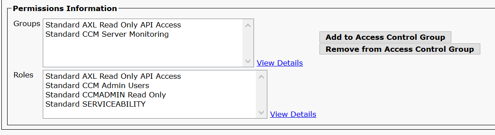

# Zabbix Template for CUCM Resources Monitoring

This template monitors the resources of each node of the CUCM cluster through AXL:

* Calls Active
* Annunciator Out Of Resources
* HW Conference Out Of Resources
* Location Out Of Resources
* MOH Out Of Resources
* MTP Out Of Resources
* MTP Resources Active
* SW Conference Out Of Resources
* Transcoder Out Of Resources
* Transcoder Resources Active
* Video Out Of Resources

## What do you need?

**Create a user and give him the appropriate permissions in CUCM**

* Create an Access Control Group and assign the roles below.

!(images/Create_Access_Group.PNG "Access Control Group") 

* Create an Application User for Zabbix and add him to created group. Add him to "Standard CCM Server Monitoring" group too.

 

**